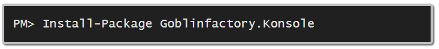

# Konsole
home of ProgressBar ( C# console progress bar with support for single or multithreaded progress updates ) and TestConsole ( The only 100%-ish* System.Console compatible test console, supporting color printing as well as .CursorTop and .CursorLeft.



##ProgressBar usage
```csharp

    using Konsole;

           . . .

            var pb = new ProgressBar(50);
            pb.Refresh(0, "connecting to server to download 50 files sychronously.");
            Console.ReadLine();

            pb.Refresh(25, "downloading file number 25");
            Console.ReadLine();
            pb.Refresh(50, "finished.");
```


[sample parallel ProgressBar code that produced the output above](readme-sample-parallel.md)

##IConsole, TestConsole and ConsoleWriter usage

````csharp
        
        using Konsole;
        ...
        public class Cat
        {
            private readonly IConsole _console;
            public Cat(IConsole console) { _console = console; }
            public void Greet()
            {
                _console.WriteLine("Prrr!");
                _console.WriteLine("Meow!");
            }
        }

        [Test]
        public void TestConsole_ConsoleWriter_and_IConsole_example_usage()
        {
            {
                // test the cat
                // ============
                var console = new TestConsole(80, 20);
                var cat = new Cat(console);
                cat.Greet();
                Assert.AreEqual(console.TrimmedLines, new[] {"Prrr!", "Meow!"});
            }
            {
                // create an instance of a cat that will purr to the real Console
                // ==============================================================
                var cat = new Cat(new ConsoleWriter());
                cat.Greet(); // prints Prrr! aand Meow! to the console
            }
        }
```

##Why I recently renames MockConsole to TestConsole

Because it' much more than just a mock. Below is a comparison of how someone might test an Invoice class using a traditional `Mock<IConsole>` and the same test, using a `Konsole.TestConsole`. To make it a fair comparison I'm comparing to [NSubstitute](http://nsubstitute.github.io/) which is quite terse and one of my favourite mocking frameworks.

```csharp

        [Test]
        public void Test_Invoice_using_mocks()
        {
            // test the invoice
            // ============
            IConsole console = new Substitute.For<IConsole>();
            var invoice = new Invoice(console);
            invoice.AddLine(2, "Semi Skimmed Milk", "2 pints", "£",1.00);
            invoice.AddLine(3, "Warburtons Crumpets", "6 pack", "£",0.89);
            invoice.Print();
                
            // not really practical to test printed output using a mock console
            // ================================================================
            console.Received().SetCursorPosition(0,0);
            console.Received().WriteLine("ACME Wholesale Foody");
            console.Received().WriteLine("--------------------");
            console.Received().WriteLine("");
            console.Received().WriteLine("--------------------");
            console.Received().Write("qty ");
            console.Received().Write(2);
            console.Received().Write(" Semi Skimmed Milk");
            console.Received().Write(", ");
            console.Received().Write("{0} pints", 2);
            console.Received().Write("£ {0.00,-10}", 2.0m);
            .
            .
            . // and so on and so on ...for probably around another 12 or 13 lines.
            .
            .
             // having to mimick the exact formatted Write's and Writelines and SetCursor movements 
             // this is brittle, if the code is optimised to replace two Write's with a single formatted WriteLine for example
             // then this test fails even though the desired output is written to the console.
        }
        
        // using a Test Double like Konsole.TestConsole the test above becomes

        [Test]
        public void testing_Invoice_class_using_TestConsole()
            {
                var expected = @"
                 ACME WHoleSale Foody 
                 -------------------- 
                 qty 2 Semi Skimmed Milk   , 2 pints     £ 2.00
                 qty 3 Warburtons Crumpets , 6 pack      £ 5.34
                 --------------
                 total   £ 7.34 
                 --------------
            
                * some random message on the footer
";
        
                IConsole console = new TestConsole();
                var invoice = new Invoice(console);
                invoice.AddLine(2, "Semi Skimmed Milk", "2 pints", "£",1.00);
                invoice.AddLine(3, "Warburtons Crumpets", "6 pack", "£",0.89);
                invoice.Print();
                Assert.AreEqual(console.Buffer,expected);
                });
            }
                
            // Now, if someone accidentally changes your currency formatter, this test will wail
            // when the rendered output to the Console suddenly changes, bwaaam! Instant Fail.
            // Score one for TestConsole, sweetness, life is good!
        }


``` 


<sub>* By 100%-ish I mean 'some', enough to make TestConsole useful enough and accurate enough that I couldn't have written a high quality progress-bar without it ;-D If you use MockConsole to help you write a console utility and find it's lacking some important features, please contact me, I'd love to hear from you and see if I can update MockConsole to help you.</sub>

##Support, Feedback, Suggestions

[@snowcode](https://twitter.com/snowcode)

