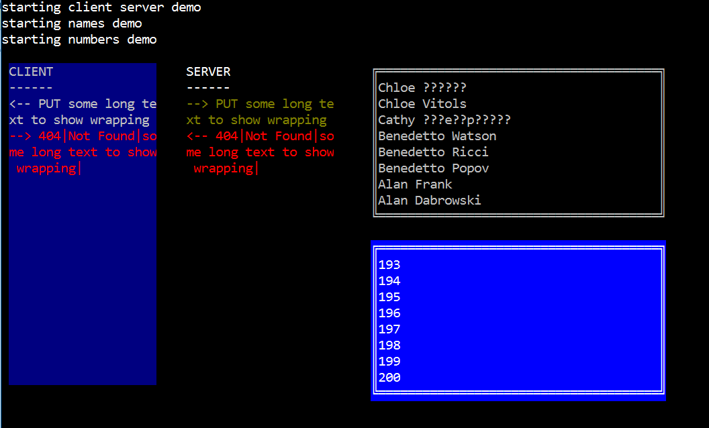
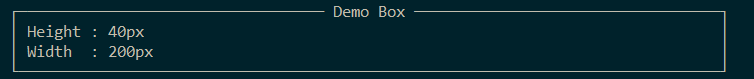
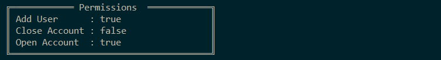

# Konsole ver 5

[](https://opensource.org/licenses/Apache-2.0) [](https://gitter.im/goblinfactory-konsole/community?utm_source=badge&utm_medium=badge&utm_campaign=pr-badge&utm_content=badge)

# Konsole library

home of the simple no-dependancy console libary consisting of:

### ProgressBar , Window  , Form , Menu , Draw & MockConsole

---


## Installing


## ProgressBar usage - simple syntax
```csharp
    using Konsole;
           
            var pb = new ProgressBar(PbStyle.DoubleLine, 50);
            pb.Refresh(0, "connecting to server to download 5 files asychronously.");
            Console.ReadLine();

            pb.Refresh(25, "downloading file number 25");
            Console.ReadLine();
            pb.Refresh(50, "finished.");
```

# ProgressBars

## ProgressBarTwoLine (alternative style)


## ProgressBar worked parallel example
```csharp
    using Konsole;
           
    Console.WriteLine("ready press enter.");
    Console.ReadLine();

    var dirCnt = 15;
    var filesPerDir = 100;
    var r = new Random();
    var q = new ConcurrentQueue<string>();
    foreach (var name in TestData.MakeNames(2000)) q.Enqueue(name);
    var dirs = TestData.MakeObjectNames(dirCnt).Select(dir => new
    {
        name = dir,
        cnt = r.Next(filesPerDir)
    });

    var tasks = new List<Task>();
    var bars = new ConcurrentBag<ProgressBar>();
    foreach (var d in dirs)
    {
        var files = q.Dequeue(d.cnt).ToArray();
        if (files.Length == 0) continue;
        tasks.Add(new Task(() =>
        {
            var bar = new ProgressBar(files.Count());
            bars.Add(bar);
            bar.Refresh(0, d.name);
            ProcessFakeFiles(d.name, files, bar);
        }));
    }

    foreach (var t in tasks) t.Start();
    Task.WaitAll(tasks.ToArray());
    Console.WriteLine("done.");
```


# Windows

  - ( 100%-ish console compatible window, supporting all normal console writing to a windowed section of the screen) 
  - Supports scrolling and clipping of console output.
  - typical uses, for showing a scrolling output, e.g. build output in a window, while showing higher level progress in another window.
  - automatic borders
  - full color support

```csharp
            var con = new Window(200,50).LockConsoleResizing();
            con.WriteLine("starting client server demo");
            var client = new Window(1, 4, 20, 20, ConsoleColor.Gray, ConsoleColor.DarkBlue, con);
            var server = new Window(25, 4, 20, 20, con);
            client.WriteLine("CLIENT");
            client.WriteLine("------");
            server.WriteLine("SERVER");
            server.WriteLine("------");
            client.WriteLine("<-- PUT some long text to show wrapping");
            server.WriteLine(ConsoleColor.DarkYellow, "--> PUT some long text to show wrapping");
            server.WriteLine(ConsoleColor.Red, "<-- 404|Not Found|some long text to show wrapping|");
            client.WriteLine(ConsoleColor.Red, "--> 404|Not Found|some long text to show wrapping|");

            con.WriteLine("starting names demo");
            // let's open a window with a box around it by using Window.Open
            var names = Window.Open(50, 4, 40, 10, "names");
            TestData.MakeNames(40).OrderByDescending(n => n).ToList()
                 .ForEach(n => names.WriteLine(n));

            con.WriteLine("starting numbers demo");
            var numbers = Window.Open(50, 15, 40, 10, "numbers", 
                  LineThickNess.Double,ConsoleColor.White,ConsoleColor.Blue);
            Enumerable.Range(1,200).ToList()
                 .ForEach(i => numbers.WriteLine(i.ToString())); // shows scrolling
```
**gives you**



# Advanced windows with `SplitRows` and `SplitColumns`

You can create advanced window layouts using `SplitRows` and `SplitColumns` passing in a collection of Splits. Pass in a size of `0` to indicate that `row` or `column` window must contain the remainder of the window space. 


```csharp
            var c = new Window().LockConsoleResizing();
            var consoles = c.SplitRows(
                    new Split(4, "heading", LineThickNess.Single),
                    new Split(0),
                    new Split(4, "status", LineThickNess.Single)
            ); ; ;

            var headline = consoles[0];
            var status = consoles[2];

            var contents = consoles[1].SplitColumns(
                    new Split(20),
                    new Split(0, "content") { Foreground = ConsoleColor.White, Background = ConsoleColor.Cyan },
                    new Split(20)
            );
            var menu = contents[0];
            var content = contents[1];
            var sidebar = contents[2];

            headline.Write("my headline");
            content.WriteLine("content goes here");

            menu.WriteLine("Options A");
            menu.WriteLine("Options B");

            sidebar.WriteLine("20% off all items between 11am and midnight tomorrow!");

            status.Write("System offline!");
            Console.ReadLine();
```

Produces the following window. Each of the console(s) that you have a reference to can be written to like any normal console, and will scroll and clip correctly. You can create progress bar instances inside these windows like any console.


Configure the properties of each section of a window with the `Split` class.

```csharp
new Split(size) 
{
    title,
    lineThickNess, 
    foregroundColor,
    backgroundColor
};
```

# Using the tests as Documentation

Because the unit tests are run on an Azure build server that does not have access a open console fileHandle most of the tests use `MockConsole`. 
Whenever you see sample code, eg the test below from [src/Konsole.Tests/WindowTests/SplitColumnsShould.cs](src/Konsole.Tests/WindowTests/SplitColumnsShould.cs) 

```csharp
    var con = new MockConsole(30, 4);
    var window = new Window(con);
    var consoles = window.SplitColumns(
            new Split(8, "col1", LineThickNess.Single),
            new Split(10, "col2", LineThickNess.Single),
            new Split(12, "col3", LineThickNess.Single)
```

In order to use the code yourself in a project, simply leave out the MockConsole, and start with a `new Window()` as below. 
The rest of the unit test code will work the same in production as in testing.

```csharp
    var window = new Window();
    var consoles = window.SplitColumns(
            new Split(8, "col1", LineThickNess.Single),
            new Split(10, "col2", LineThickNess.Single),
            new Split(12, "col3", LineThickNess.Single)
            ... rest of code
```

# Side by side writing 

TBD : describe how Konsole workes side by side with existing code or apps that share the console.

# Forms

  - quickly and neatly render an object and it's properties in a window or to the console.
  - support multiple border styles.
  - Support C# objects or dynamic objects

Readonly forms are currently rendered. Below are examples showing auto rendering of simple objects.
(Currently only text fields, readonly, simple objects.)
On the backlog; add additional field types, complex objects, and editing. 

```csharp
        using Konsole.Form;
        ...
            var form1 = new Form(80,new ThickBoxStyle());
            var person = new Person()
            {
                FirstName = "Fred",
                LastName = "Astair",
                FieldWithLongerName = "22 apples",
                FavouriteMovie = "Night of the Day of the Dawn of the Son 
                of the Bride of the Return of the Revenge of the Terror 
                of the Attack of the Evil, Mutant, Hellbound, Flesh-Eating 
                Subhumanoid Zombified Living Dead, Part 2: In Shocking 2-D"
            };
            form1.Write(person);
```


```csharp        

           // works with anonymous types
            new Form().Write(new {Height = "40px", Width = "200px"}, "Demo Box");
```


```csharp        

            // change the box style, and width
            new Form(40, new ThickBoxStyle()).Show(new { AddUser= "true", CloseAccount = "false", OpenAccount = "true"}, "Permissions");
```



# `Goblinfactory.Konsole.Windows`

## HighSpeedWriter 

If you want to write a console game, or serious console application that you've tested and it's too slow using normal Konsole writing, and you are OK with the app only running on windows, then you can use `HighSpeedWriter`, which is available as an additional nuget package `Goblinfactory.Konsole.Windows` to write to the console window via windows `Kernal32` for really high speed. This package has a dependancy on `Goblinfactory.Konsole` so you can simply install this package to get all the features. (nuget will automatically install the dependant package as well for you.)

If you are only going to be updating small portions of the screen, then it is less CPU intensive to simply use `PrintAt` without a highspeed writer. 

The other trade off is you need to keep calling `.Flush()` on your writer to refresh the screen. For a game you could dedicate a timer thread to refresh on `tick` and allow you to control the refresh rate, and cpu usage. Higher refresh rates will use more cpu.

```dos
Install package `goblinfactory.konsole.windows`
```

`HighSpeedWriter` can write to a 120 x 60 console window at over 30 frames per second with minimal CPU overhead.

TBD - INSERT GIF SHOWING DEMO OF HIGH SPEED OUTPUT

## Getting started with `HighSpeedWriter`

You use `Konsole` in the same way as described in the docs further above, except that all output is buffered, and you need to call `Flush()` on the writer when you want to update the screen. 

If you have multiple threads writing to the Console, then instead of calling flush all the time, another option is to create a background thread that will `tick` over and refresh the screen x times a second. (depending on what framerate you require).

# End to end sample - `HighSpeedWriter`

below is code that should give you a clue as to how I'm using HighSpeedWriter for myself. This sample code produces the following screen and output.


**Below is the source code that produced these screenshots** It is also available in the code in the single file demo project [src/TestPackage/Program.cs](src/TestPackage/Program.cs)

```csharp

using System;
using System.Threading;
using System.Threading.Tasks;
using Konsole;
using Konsole.Internal;
using static System.ConsoleColor;

namespace TestPackage
{
    class Program
    {
        static bool finished = false;
        static bool crazyFast = false;
        static Func<bool> rand = () => new Random().Next(100) > 49;
        static void Main(string[] args)
        {


            using var writer = new HighSpeedWriter();
            var window = new Window(writer);

            window.CursorVisible = false;
            
            var left = window.SplitLeft();
            var leftConsoles = left.SplitRows(
                new Split(0),
                new Split(10, "status"),
                new Split(10)
                );

            var status = leftConsoles[1];           
            status.BackgroundColor = Yellow;
            status.ForegroundColor = Red;
            status.Clear();

            var stocksCon = leftConsoles[0];            
            var menuCon = leftConsoles[2];
            var namesCon = window.SplitRight("numbers B");

            var r = new Random();
            int speed = 200;
            int i = 0;

            // print random names in random colors 
            // and demonstrate scrolling and wrapping at high speed
            var t1 = Task.Run(() => {
                var names = TestData.MakeNames(500);
                while (!finished)
                {
                    if (crazyFast)
                    {
                        while (crazyFast && !finished)
                        {
                            // fill a screen full before flushing
                            // this is super quick because writer 
                            // simply writes to a buffer and no actual
                            // slow IO has happened yet
                            for(int x = 0;x < 100; x++)
                            {
                                var color = (ConsoleColor)(r.Next(100) % 16);
                                namesCon.Write(color, $" {names[i++ % names.Length]} ");
                            }
                            // now lets flush this massive block of updates
                            writer.Flush();
                        }
                    }
                    else
                    {
                        var color = (ConsoleColor)(r.Next(100) % 16);
                        namesCon.Write(color, $" {names[i % names.Length]} ");
                        if (finished) break;
                        Thread.Sleep(r.Next(speed));
                        writer.Flush();
                    }
                }
            });


            // a window with more slower printing numbers
            var t2 = Task.Run(() => {
                while(!finished)
                {
                    namesCon.Write(Green, $"({i++}) ");
                    Thread.Sleep(speed * 10);
                    writer.Flush();
                }
            });

            var t3 = Task.Run(() =>
            {
                // stock ticker simulation
                var stocksNYSE = new[] { "BRK.A", "MSFT", "AMZN", "BTG.L", "AAPL", "LWRF.L", "GBLN1", "GBLN2" };
                var stocksFTSE = new[] { "SDR", "WPP", "ABF", "BP", "AVV", "AAL", "KGF", "MNDI", "NG","RM", "NXT","PSON" };
                var FTSE100Con = stocksCon.SplitLeft("FTSE 100");
                var NYSECon = stocksCon.SplitRight("NYSE");

                while (!finished)
                {
                    decimal move = (decimal)r.Next(100) / 10;
                    decimal newPrice = (50 + r.Next(100) + move);
                    decimal perc = ((decimal)r.Next(2000) / 100);
                    var increase = rand() ? true : false;
                    var sign = increase ? '+' : '-';
                    var changeColor = perc < 10 ? Cyan : increase ? Green : Red;
                    IConsole con;
                    string stock;
                    if (rand())
                    {
                        con = FTSE100Con;
                        stock = stocksFTSE[r.Next(stocksFTSE.Length)];
                    }
                    else
                    {
                        con = NYSECon;
                        stock = stocksNYSE[r.Next(stocksNYSE.Length)];
                    }
                    con.Write(White, $"{stock,-10}");
                    con.WriteLine(changeColor, $"{newPrice:0.00}");
                    con.WriteLine(changeColor, $"  ({sign}{newPrice}, {perc}%)");
                    con.WriteLine("");
                    Thread.Sleep(r.Next(5000));
                }
            });


            // create a menu inside the menu console window
            // the menu will write updates to the status console window

            var menu = new Menu(menuCon, "Progress Bars", ConsoleKey.Escape, 30,
                new MenuItem('s', "slow", () =>
                {
                    speed = 200;
                    status.Write(White, $" : {DateTime.Now.ToString("HH:mm:ss - ")}");
                    status.WriteLine(Green, $" SLOW ");
                    crazyFast = false;
                }),
                new MenuItem('f', "fast", () =>
                {
                    speed = 10;
                    status.Write(White, $" : {DateTime.Now.ToString("HH:mm:ss - ")}");
                    status.WriteLine(White, $" FAST ");
                    crazyFast = false;
                }),
                new MenuItem('c', "crazy fast", () =>
                {
                    speed = 1;
                    crazyFast = true;
                    status.Write(White, $" : {DateTime.Now.ToString("HH:mm:SS - ")}");
                    status.WriteLine(Red, $" CRAZY FAST ");
                })

            );

            status.WriteLine("press up and down to select a menu item, and enter or highlighted letter to select. Press escape to quit.");

            // menu writes to the console automatically,
            // but because we're using a buffered screen writer
            // we need to flush the UI after any menu action.
            menu.OnAfterMenuItem = _ => writer.Flush();

            menu.Run();
            // menu will block until user presses the exit key.

            finished = true;
            Task.WaitAll(t1, t2, t3);

            window.Clear();
            window.WriteLine("thank you for flying Konsole air.");
            writer.Flush();
        }
    }
}


```

# Why did I write Konsole?

Q: What do I (Alan Hemmings) use my own package for, and why do I put so much effort in?

A: I use it to allow me to write simple test projects, or "reference architecture" projects when evaulating various libraries, (for example, `Akka.net`, `memstate` or `eventstor` ) It allows me to write simple console apps that are easy to understand and render in a visually simple way, especially when there are multiple threads, actors or servers that I need to visual represent without getting sidetracked building a WPF or windforms or web application. 

I'm now also using it for more serious applications. I'm using `Konsole` in `Gunner` a `.NET` testing library similar to `Gattling` that I need to put code under stress when evaulating different enterprise messaging libraries.

# Open source projects already using Konsole

- 10 alternatives to Akka.net : (A console based reference architecture using Konsole to simplify the demo / reference code)
- Please add your project to this list. (drop me a tweet or email)

Samples I am busy with 

- remote Konsole. Run a console app on a remote linux container and view the output in a console window in a browser on any platform.


# Debugging problems with Konsole, random items

## This project may not be fully compatible with your project.

When building .NET standard or .NET core app, you may recieve the following warning. If you have `treat warnings as errors` turned on, then this will fail your build.

> Warning	NU1702	ProjectReference 'C:\src\git-alan-public\konsole-spike\Konsole.Platform.Windows\Konsole.Platform.Windows.csproj' was resolved using '.NETFramework,Version=v4.6.1' instead of the project target framework '.NETStandard,Version=v2.0'. This project may not be fully compatible with your project.	Konsole	C:\Program Files (x86)\Microsoft Visual Studio\2019\Preview\MSBuild\Current\Bin\Microsoft.Common.CurrentVersion.targets		1653

This is not a problem for Konsole and is a bug in .NET where .NET standard 2.0 apps should be able to reference up to .NET framework 4.6.1 without errors. To suppress this error, add the following to your project file.

```xml
    <MSBuildWarningsAsMessages>NU1702</MSBuildWarningsAsMessages>  
```

## No visible output, blank screen

If you are using the `HighSpeedWriter` you must call `Flush()` to render the output.


# Writing Tests for your code that uses Konsole

## Tests for code using HighSpeedWriter

TBD

## All other tests

TBD

# MockConsole

## MockConsole (substitute), and IConsole (interface) usage

Use MockConsole as a real (fully functional) System.Console substitute, that renders with 100% fidelity to an internal buffer that can be used to assert correct console behavior of any object writing using IConsole.
MockConsole can even render out a text representation of the current state of the the console, including representations for the foreground and background color of anything written.

All the test for this library have been written using `MockConsole.` For a fully detailed examples of `MockConsole` being stretched to the limits, see `Konsole.Tests.WindowTests`.

```csharp
        
        using Konsole;
        ...
        public class Cat
        {
            private readonly IConsole _console;
            public Cat(IConsole console) { _console = console; }
            public void Greet()
            {
                _console.WriteLine("Prrr!");
                _console.WriteLine("Meow!");
            }
        }

        [Test]
        public void TestConsole_ConsoleWriter_and_IConsole_example_usage()
        {
            {
                // test the cat
                // ============
                var console = new TestConsole(80, 20);
                var cat = new Cat(console);
                cat.Greet();
                Assert.AreEqual(console.BufferWrittenTrimmed, new[] {"Prrr!", "Meow!"});
            }
            {
                // create an instance of a cat that will purr to the real Console
                // ==============================================================
                var cat = new Cat(new ConsoleWriter());
                cat.Greet(); // prints Prrr! aand Meow! to the console
            }
        }
```


## `MockConsole` vs `Mock<IConsole>`

Below is a comparison of how someone might test an Invoice class using a traditional `Mock<IConsole>` and the same test, using a `Konsole.MockConsole`. To make it a fair comparison I'm comparing to [NSubstitute](http://nsubstitute.github.io/) which is quite terse and one of my favourite mocking frameworks.

```csharp

        [Test]
        public void Test_Invoice_using_mocks()
        {
            // test the invoice
            // ============
            IConsole console = new Substitute.For<IConsole>();
            var invoice = new Invoice(console);
            invoice.AddLine(2, "Semi Skimmed Milk", "2 pints", "£",1.00);
            invoice.AddLine(3, "Warburtons Crumpets", "6 pack", "£",0.89);
            invoice.Print();
                
            // not really practical to test printed output using a mock console
            // ================================================================
            console.Received().SetCursorPosition(0,0);
            console.Received().WriteLine("ACME Wholesale Foody");
            console.Received().WriteLine("--------------------");
            console.Received().WriteLine("");
            console.Received().WriteLine("--------------------");
            console.Received().Write("qty ");
            console.Received().Write(2);
            console.Received().Write(" Semi Skimmed Milk");
            console.Received().Write(", ");
            console.Received().Write("{0} pints", 2);
            console.Received().Write("£ {0.00,-10}", 2.0m);
            .
            .
            . // and so on and so on ...for probably around another 12 or 13 lines.
            .
            .
             // having to mimick the exact formatted Write's and Writelines and SetCursor movements 
             // this is brittle, if the code is optimised to replace two Write's with a single formatted WriteLine for example
             // then this test fails even though the desired output is written to the console.
        }
        
```

using a Test Double like `Konsole.MockConsole` the test above becomes

```csharp
        [Test]
        public void testing_Invoice_class_using_MockConsole()
            {
                var expected = @"
                 ACME WHoleSale Foody 
                 -------------------- 
                 qty 2 Semi Skimmed Milk   , 2 pints     £ 2.00
                 qty 3 Warburtons Crumpets , 6 pack      £ 5.34
                 --------------
                 total   £ 7.34 
                 --------------
            
                * some random message on the footer
";
        
                var console = new MockConsole();
                var invoice = new Invoice(console);
                invoice.AddLine(2, "Semi Skimmed Milk", "2 pints", "£",1.00);
                invoice.AddLine(3, "Warburtons Crumpets", "6 pack", "£",0.89);
                invoice.Print();
                Assert.AreEqual(console.BufferString,expected);
                });
            }
                
            // Now, if someone accidentally changes your currency formatter, this test will wail
            // when the rendered output to the Console suddenly changes, bwaaam! Instant Fail.
            // Score one for MockConsole, sweetness, life is good!
        }


``` 

# Draw

TBD

## Cross platform notes
ProgressBar has been manually tested with Mono on Mac in version 1.0. I don't currently have any automated testing in place for OSX (mono) and Linux. That's all on the backlog.
It's possible I might split out the ProgressBar into a seperate nuget package, since that appeared to work remarkably well cross platform, while `Window` makes calls to some `System.Console` methods that are not supported in Mono.

The scrolling support currently uses `Console.MoveBufferArea` which is not implemented on Mono. I will be working on a suitable alrternative to this on Linux and OSX. (on the backlog) Biggest challenge will be doing crossplatform testing, ...mmm, I predict I will be eating [Cake](http://cakebuild.net/docs/tutorials/getting-started) and containers in the very near future!

# Source code

## Building the solution


### using visual studio

 1. `git clone https://github.com/goblinfactory/konsole.git`
 2. run the following commands from the root folder;

### requirements

Any version of .net core. Update `global.json` to the version of .net core you have installed and run the command below in order.

 > dotnet restore

 > dotnet build
 
 > dotnet test
 


## ChangeLog

* [changelog](change-log.md)

The format is based on [Keep a Changelog](http://keepachangelog.com/) 
and this project adheres to [Semantic Versioning](http://semver.org/).

## Support, Feedback, Suggestions

Please drop me a tweet if you find Konsole useful. Latest updates to Konsole was written at Snowcode 2017.
keep chillin!

    O__
    _/`.\
        `=( 

Alan

[p.s. join us at snowcode 2020! ](http://www.snowcode.com?refer=konsole) <br/>
[www.snowcode.com](http://www.snowcode.com?refer=konsole) <br/>
(free dev conf at great ski resort)<br/>
developers + party + snow + great learning
April 2020 end of season snowcode conf, slushfest, best for boarders! :D will try to be at a glacier for the skiers.

[@snowcode](https://twitter.com/snowcode)

