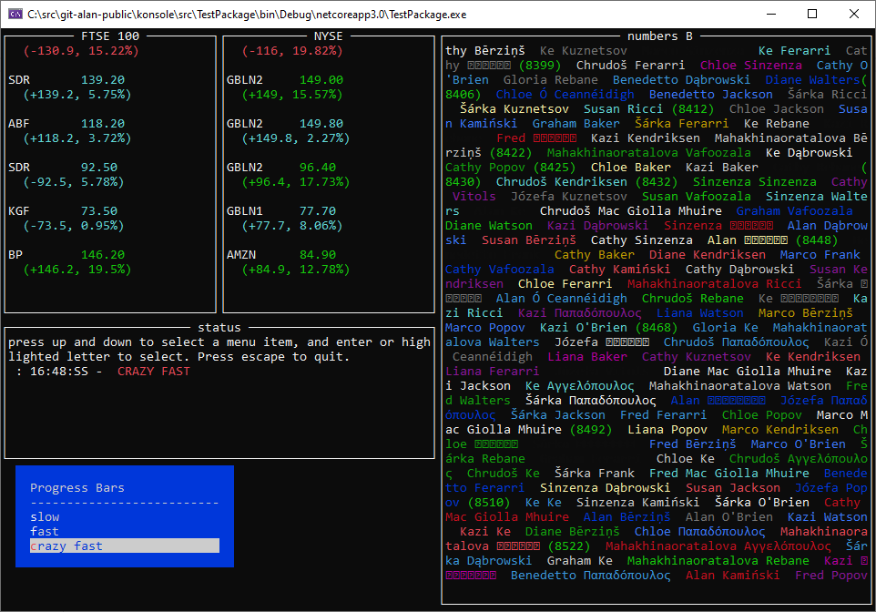
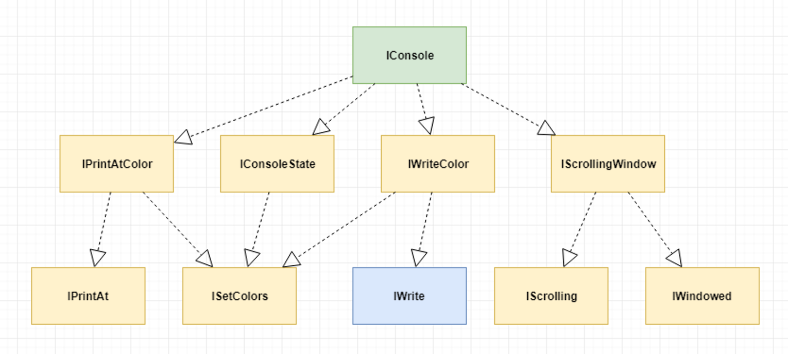
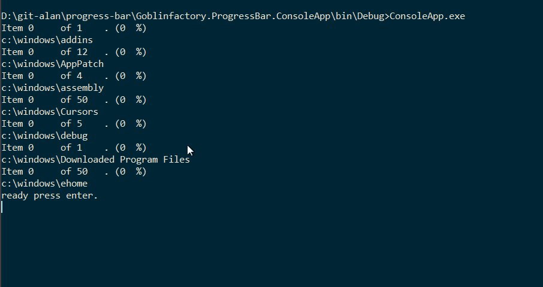
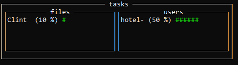
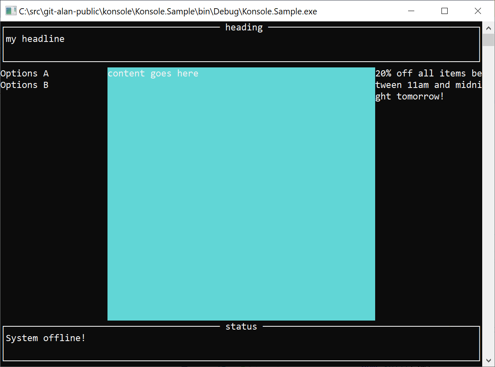
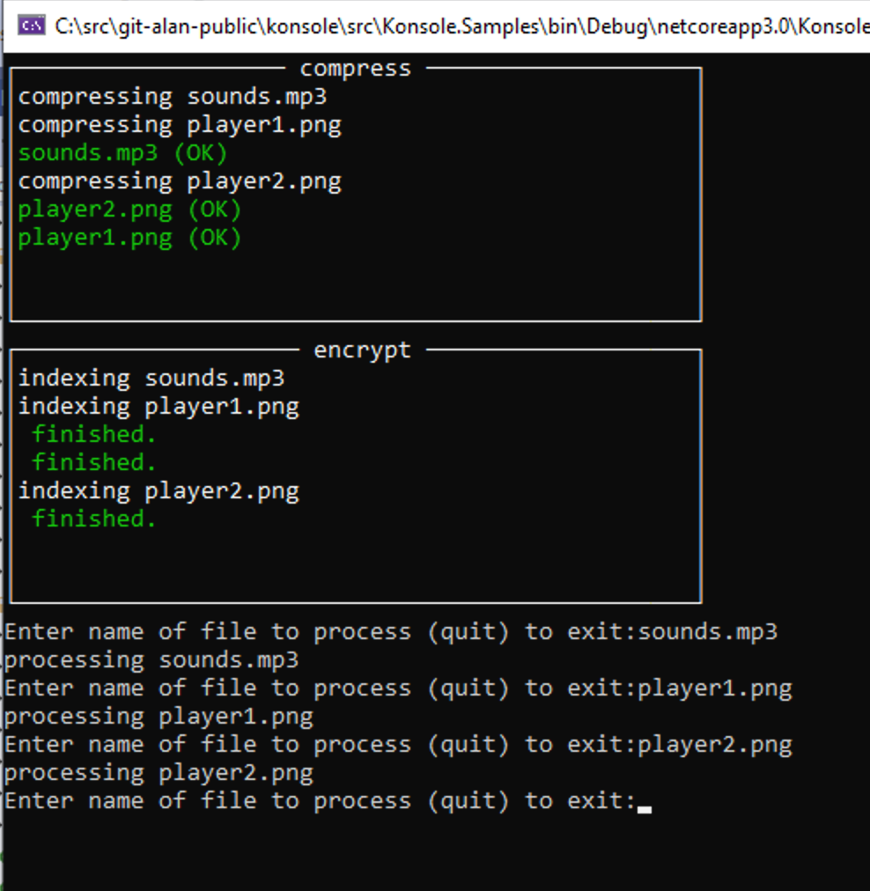
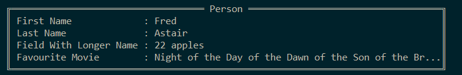
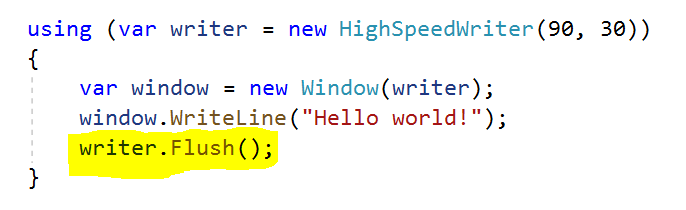

#  Konsole 


[](https://www.nuget.org/packages/IConsole/)
[](https://www.nuget.org/packages/Goblinfactory.Konsole/) 
[](https://opensource.org/licenses/Apache-2.0) 
[](https://gitter.im/goblinfactory-konsole/community?utm_source=badge&utm_medium=badge&utm_campaign=pr-badge&utm_content=badge)

Low ceremony, Fluent DSL for writing console apps, utilities and spike projects. Providing thread safe progress bars, windows and forms and drawing for console applications. Build UX's as shown below in very few lines of code. Konsole provides simple threadsafe ways to write to the C# console window. [See my notes on threading](docs/threading.md). The project is growing quickly with fast responses to issues raised. 

If you have any questions on how to use Konsole, please join us on Gitter (https://gitter.im/goblinfactory-konsole/community?source=orgpage) and I'll be happy to help you. 

cheers, 

Alan



## Contents

  * [Installing and getting started](#installing-and-getting-started)
  * [using static Console.ConsoleColor](#using-static-consoleconsolecolor)      
  * [IConsole](readme-iconsole.md)
  * [ConcurrentWriter](#concurrentwriter)
  * [Progress Bars](#progressbars)
    * [ProgressBar worked parallel example](#progressbar-worked-parallel-example)
    * [DoubleLine progress bar](#doubleline-progress-bar)
  * [Threading and threadsafe writing to the Console.](#threading-and-threadsafe-writing-to-the-console)
    * [Threadsafe static constructors](#threadsafe-static-constructors)
    * [new Window is not threadsafe](#new-window-is-not-threadsafe)
    * [Make it threadsafe](#make-it-threadsafe)
    * [ConcurrentWriter](#concurrentWriter)
  * [Window](#window)
      * [Floating constructors](#floating-constructors)
      * [Inline constructors](#floating-constructors)
      * [Fullscreen constructor](#fullscreen-constructor)
    * [Static constructors](#static-constructors)
      * [OpenBox](#openbox)
      * [Open](#open)
    * [methods and extension methods](#methods-and-extension-methods)
      * [PrintAt](#printat)
      * [PrintAtColor](#printatcolor)
      * [Write](#write)
      * [WriteLine](#writeline)
      * [SplitRows](#splitrows)
      * [SplitColumns](#splitcolumns)
      * [SplitLeft](#splitleft)
      * [SplitRight](#splitright)
      * [SplitLeftRight](#splitleftright)
      * [SplitTop](#splittop)
      * [SplitBottom](#splitbottom)
      * [SplitTopBottom](#splittopbottom)
    * [Nested Windows](#nested-windows)
    * [Window properties](#window-properties)
    * [Advanced windows with SplitRows and SplitColumns](#advanced-windows-with-splitrows-and-splitcolumns)
    * [Input](#Input)
    * [Clipping and Transparency](#clipping-and-transparency)
    * [Draw](#draw)
      * [Box](#box)
      * [Line](#line)
    * [Forms](#forms)
      * [Write](#write)
      * [Rendering Null objects](#rendering-null-objects)
      * [Rendering Nullable fields](#rendering-nullable-fields)
    * [HighSpeedWriter](#highspeedwriter)
      * [Getting started with HighSpeedWriter](#getting-started-with-highspeedwriter)
      * [HighSpeedWriter end to end sample](#highspeedwriter-end-to-end-sample)
    * [Copying code from the unit tests](#copying-code-from-the-unit-tests)
    * [Other .NET console libraries](#other-net-console-libraries)
    * [Why did I write Konsole?](#why-did-i-write-konsole)
    * [Debugging problems with Konsole](#debugging-problems-with-konsole)
      * [warning NU1702](#warning-nu1702)
      * [No visible output, blank screen](#no-visible-output-blank-screen)
      * [Corrupt output](#corrupt-output)
    * [MockConsole](#mockconsole)
      * [MockConsole vs Mock<IConsole>](#mockconsole-vs-mockiconsole)
    * [Building the solution](#building-the-solution)
    * [ChangeLog](#changelog)
    * [support me, please check out Snowcode, a free developer conference I hold every year at a great ski venue](www.snowcode.com)
    
## Nuget Packages

 * https://nuget.org/packages/Goblinfactory.Konsole/
 * https://nuget.org/packages/Goblinfactory.Konsole.Windows/

## Installing and Getting started

1. start a new console application 

```
dotnet new console -n myutility
```
2. add `Konsole` package 
```
dotnet add package Goblinfactory.Konsole
```

3. add the code in the same shown below to your  `void main(string[] args)` method
4. run your program

```
dotnet run
```

Will give you the screenshot on the right. If not, please [join our gitter chat and get some help.](https://gitter.im/goblinfactory-konsole/community)

have fun!

Alan


```csharp

using Konsole.Internal;
using System;
using System.Collections.Generic;
using System.Threading;
using System.Threading.Tasks;
using static System.ConsoleColor;

class Program
{
    static void Main(string[] args)
    {

        // quick dive in example 

        void Wait() => Console.ReadKey(true);

        // show how you can mix and match System.Console with Konsole
        Console.WriteLine("line one");

        // create an inline Box window at the current cursor position 
        // 20 characters wide, by 12 tall.
        // returns a Window that implements IConsole 
        // that you can use to write to the window 
        // and create new windows inside that window.
        
        var nyse = Window.OpenBox("NYSE", 20, 12, new BoxStyle() { 
            ThickNess = LineThickNess.Single, 
            Title = new Colors(White, Red) 
        });
        
        Console.WriteLine("line two");

        // create another inline Box window at the current cursor position
        var ftse100 = Window.OpenBox("FTSE 100", 20, 12, new BoxStyle() { 
            ThickNess = LineThickNess.Double, 
            Title = new Colors(White, Blue) 
        });
        Console.Write("line three");


        while(true) {
            Tick(nyse, "AMZ", amazon -= 0.04M, Red, '-', 4.1M);
            Tick(ftse100, "BP", bp += 0.05M, Green, '+', 7.2M);
            Wait();
        }

        decimal amazon = 84;
        decimal bp = 146;

        // simple method that takes a window and prints a stock price 
        // to that window in color
        void Tick(IConsole con, string sym, decimal newPrice, 
           ConsoleColor color, char sign, decimal perc) 
        {
            con.Write(White, $"{sym,-10}");
            con.WriteLine(color, $"{newPrice:0.00}");
            con.WriteLine(color, $"  ({sign}{newPrice}, {perc}%)");
            con.WriteLine("");
        }
    }
}
```

## using static Console.ConsoleColor

If you will be using a lot of different colors throughout your application I recommend making use of the new C# `static using` language feature to make the code a bit easier to read.

before
```csharp
Console.WriteLine(ConsoleColor.Red, "I am red"); 
var box = Window.OpenBox("warnings", new BoxStyle() { Title = new Colors(ConsoleColor.White, ConsoleColor.Red) })
```
becomes
```csharp
using static System.Console;
...
Console.WriteLine(Red, "I am red"); 
var box = Window.OpenBox("warnings", new BoxStyle() { Title = new Colors(White, Red) })
```

## IConsole

This is the main interface that all windows, and objects that wrap a window, or that wrap the `System.Console` writer. It implements the almost everything that `System.Console` does with some extra magic. `IConsole` is a well thought out .NET System.Console abstractions. Use to remove a direct dependancy on System.Console and replace with a dependancy on a well used and well known console interface, `IConsole`, to allow for building rich 'testable', high quality interactive console applications and utilities.

For more information about the different interfaces [please see the full documentation for the contracts, as well as details of each interface here](docs/iconsole.md)




# Progress bars

## ProgressBar

Create a threadsafe one or two line progress bar. 

```csharp
    var pb = new ProgressBar(PbStyle.DoubleLine, 50);
    pb.Refresh(0, "connecting to server to download 5 files asychronously.");
    Console.ReadLine();

    pb.Refresh(25, "downloading file number 25");
    Console.ReadLine();
    pb.Refresh(50, "finished.");
```

You can create a `SingleLine` or a `DoubleLine` progress bar. If none is specified, the a single line progressbar is created.

```
var pb1 = new ProgressBar(max);
```
#### ProgressBar worked parallel example


```csharp       
using Konsole.Internal;
using System;
using System.Collections.Concurrent;
using System.Collections.Generic;
using System.Linq;
using System.Threading;
using System.Threading.Tasks;

static void Main(string[] args) {

    var dirCnt = 15;
    var filesPerDir = 30;

    var r = new Random();
    var dirs = TestData.MakeObjectNames(dirCnt);

    Console.WriteLine("Press enter to start");

    var tasks = new List<Task>();
    var bars = new ConcurrentBag<ProgressBar>(); 
    foreach (var d in dirs)
    {
        var files = TestData.MakeNames(r.Next(filesPerDir));
        var bar = new ProgressBar(files.Count());
        bars.Add(bar);
        bar.Refresh(0, d);
        tasks.Add(ProcessFakeFiles(d, files, bar));
    }
    Console.ReadLine();
    start = true;
    Task.WaitAll(tasks.ToArray());
    Console.WriteLine("finished.");
    Console.ReadLine();
}    
```

#### DoubleLine progress bar

Double line progress bar is useful if you want to roll up and display the overall progress of a parent group, while displaying the names of the items being processed seperately. For example, when processing a number of folders and files inside folders, then use a DoubleLine `ProgressBar`.

```
var pb2 = new ProgressBar(PbStyle.DoubleLine, files.Count());
```



## Open a progressbar inside a window

To open a progress bar inside a new window, just pass the window (`IConsole`) as the first parameter.

snippet: ProgressBarInsideWindow

Gives you




# Threading and threadsafe writing to the Console.

If you have a background thread that writes to the screen, then you have to make sure that the thread code is threadsafe, with regards to the console. `System.Console` by default is not threadsafe. Use `new ConcurrentWriter()` to create a simple threadsafe writer that will write to the current console window. New Window is not threadsafe. Call `.Concurrent()` on a new window to return a thread safe window.

All the static constructors return threadsafe windows by default; So

#### Threadsafe static constructors

- `Window.Open`
- `Window.OpenBox`
- `Window.OpenInline`
- `new ConcurrentWriter()`
- `new Window().Concurrent()`

#### new Window is not threadsafe

```csharp
var myWindow new Window(...);
```

You can make an existing window instance safe by either calling `.Concurrent()` on an instance, or by only using that window as a region that is then Split using one of the extension methods, `SplitTop`, `SplitBottom`, `SplitLeftRight` etc. Those are static extension methods, and like the static constructors, they all return threadsafe instances wrapped in a `new ConcurrentWriter()`.

#### Make it threadsafe

```csharp
// create an 80 by 20 inline window
var window = new Window(80, 20);

// split that window into boxes
var left = window.SplitLeft("left");
var right = window.SplitRight("right");

// right and left are threadsafe, window is not.

var safewin = window.Concurrent();

// safewin is threadsafe, window is still NOT threadsafe.

safewin.WriteLine(Green, "This is threadsafe");

```

## ConcurrentWriter

Provides a threadsafe way to write to the current console. You need to switch to writing to the console using a concurrent writer any time you have a background thread that is updating any portion of a console screen or a `Konsole` window. 

```csharp
var console = new ConcurrentWriter();

console.WriteLine(Green, $"finished encrypting {bytes} bytes.");
console.Write(...)
console.PrintAt(...)
```

You wrap any instance of any class that implements `IConsole` in a `ConcurrentWriter` Make any code of yours that implements `IConsole`  threadsafe when writing to the console.

```csharp
var myThreadSafeWriter = new ConcurrentWriter(myObjectThatImplementsIConsole);
```
# The Window object

## Window

```csharp
var window = new Window();
```

Create a windowed region of the console (with or without a boxed border and title) that you can write to as if it were a new Console. It will wrap text and scroll, and you can print to it using PrintAt, as well as nest child windows in windows for more advanced window layouts.

  - ( 100%-ish console compatible window, supporting all normal console writing to a windowed section of the screen) 
  - Supports scrolling and clipping of console output.
  - typical uses, for showing a scrolling output, e.g. build output in a window, while showing higher level progress in another window.
  - automatic borders
  - full color support

#### Floating constructors

When you provide a startX and startY position, as well as height and width, then the window created will be a `floating` window. The following are all floating constructors. The default foreground and background colors when none are provided are white on black.

#### Inline constructors

When you do not provide a startX and startY position, and only provide a height and width, then the window created is an `inline` window. The window is created starting at the next line using the height and width provided. The parent console `CursorTop` is advanced to the next line after the newly created window, and the cursorLeft is set to `0`.

- `public Window(int width, int height)`
- `public Window(int width, int height, ConsoleColor foreground, ConsoleColor background)`

#### fullscreen constructor

When no start position or height and width is provided, then the window is fullscreen. It fill the entire parent window, even if the cursor is halfway down the parent window at the time. The cursor position is reset to the parent window `0,0`.

* `Window()`

```csharp
var myConsoleAppMainWindow = new Window();
```

#### window example        

```csharp
var con = Window.OpenBox("client server demo", 110, 30);

con.WriteLine("starting client server demo");
var client = new Window(1, 4, 20, 20, ConsoleColor.Gray, ConsoleColor.DarkBlue, con).Concurrent();
var server = new Window(25, 4, 20, 20, con).Concurrent();
client.WriteLine("CLIENT");
client.WriteLine("------");
server.WriteLine("SERVER");
server.WriteLine("------");
client.WriteLine("<-- PUT some long text to show wrapping");
server.WriteLine(ConsoleColor.DarkYellow, "--> PUT some long text to show wrapping");
server.WriteLine(ConsoleColor.Red, "<-- 404|Not Found|some long text to show wrapping|");
client.WriteLine(ConsoleColor.Red, "--> 404|Not Found|some long text to show wrapping|");

con.WriteLine("starting names demo");
// let's open a window with a box around it by using Window.Open
var names = Window.OpenBox("names", 50, 4, 40, 10);
TestData.MakeNames(40).OrderByDescending(n => n).ToList()
        .ForEach(n => names.WriteLine(n));

con.WriteLine("starting numbers demo");
var numbers = Window.OpenBox("{numbers", 50, 15, 40, 10, new BoxStyle() { ThickNess = LineThickNess.Double, Body = new Colors(White, Blue) });
Enumerable.Range(1, 200).ToList()
        .ForEach(i => numbers.WriteLine(i.ToString())); // shows scrolling

Console.ReadKey(true);
```
gives you


# Static constructors

## OpenBox

- `Window.OpenBox(string title)`
- `Window.OpenBox(string title, BoxStyle style)`
- `Window.OpenBox(string title, int sx, int sy, int width, int height)`
- `Window.OpenBox(string title, int width, int height, BoxStyle style = null)`
- `Window.OpenBox(string title, int sx, int sy, int width, int height, BoxStyle style)`

Open a full screen styled window with a lined box border with a title. Styling allows for setting foreground and background color of the Line, Title, and body, as well as the line thickness, single or double using default styling, white on black, single thickness line. 

```csharp4

  [Test]
        public void WhenNested_draw_a_box_around_the_scrollable_window_with_a_centered_title_and_return_a_live_window_at_the_correct_screen_location()
        {
            var con = new MockConsole(20, 9);
            Window.HostConsole = con;
            var parent = Window.OpenBox("parent", 0, 0, 20, 8, new BoxStyle() { ThickNess = LineThickNess.Double });
            var child = parent.OpenBox("c1", 7, 2, 8, 4);
            parent.WindowWidth.Should().Be(18);
            parent.WindowHeight.Should().Be(6);
            //var child = parent.OpenBox("c1", 7, 2, 8, 4);

            parent.WriteLine("line1");
            parent.WriteLine("line2");

            var expected = new[]
            {
                        "╔═════ parent ═════╗",
                        "║line1             ║",
                        "║line2             ║",
                        "║       ┌─ c1 ─┐   ║",
                        "║       │      │   ║",
                        "║       │      │   ║",
                        "║       └──────┘   ║",
                        "╚══════════════════╝",
                        "                    "
            };

            con.Buffer.Should().BeEquivalentTo(expected);

            child.WriteLine("cats");
            child.Write("dogs");
            
            expected = new[]
            {
                        "╔═════ parent ═════╗",
                        "║line1             ║",
                        "║line2             ║",
                        "║       ┌─ c1 ─┐   ║",
                        "║       │cats  │   ║",
                        "║       │dogs  │   ║",
                        "║       └──────┘   ║",
                        "╚══════════════════╝",
                        "                    "
            };

            con.Buffer.Should().BeEquivalentTo(expected);

            // should not interfere with original window cursor position so should still be able to continue writing as 
            // if no new child window had been created.

            parent.WriteLine("line3");
            parent.WriteLine("line4");

            expected = new[]
{
                        "╔═════ parent ═════╗",
                        "║line1             ║",
                        "║line2             ║",
                        "║line3  ┌─ c1 ─┐   ║",
                        "║line4  │cats  │   ║",
                        "║       │dogs  │   ║",
                        "║       └──────┘   ║",
                        "╚══════════════════╝",
                        "                    "
            };

            con.Buffer.Should().BeEquivalentTo(expected);
        }
```

## Open

`Window.Open()`

Calling `Window.Open()` without any parameters will create a new window region consisting of the whole screen, and will clear the screen, and reset the cursor position. Returns a threadsafe `Concurrent` window.

```csharp
var win = Window.Open();
```
this is equivalent to 
```
var win = new Window().Concurrent();
```

# Methods and Extension Methods

These methods require an existing instance of a window. (`IConsole`)

## PrintAt

- `PrintAt(int x, int y, char c)`
- `PrintAt(x, y, text)`
- `PrintAt(int x, int y, string format, params object[] args)`

PrintAt an area of a window

```csharp
 var window = new Window();
 ...
 window.PrintAt(20, 20, "WARNING!");
```

## PrintAtColor

- `PrintAtColor(ConsoleColor foreground, int x, int y, string text, ConsoleColor? background = null)`

PrintAt an area of a window providing the color.

```csharp
 var window = new Window();
 ...
 window.PrintAtColor(Red, 20, 20, "WARNING!", White);
```

Print the text, optionally wrapping and causing any scrolling in the current window, at cursor position X,Y in foreground and background color without impacting the current window's cursor position or colours. This method is only threadsafe if you have created a window by using .ToConcurrent() after creating a new Window(), or the window was created using Window.Open(...) which returns a threadsafe window.

## Write

Write the text to the window in the color, withouting resetting the window's current foreground colour.  Optionally causes text to wrap, and if text moves beyond the end of the window causes the window to scroll. The cursor of the window that did the writing remains at the last printed position, and no other window's cursor positions are changed.

- `Write(string text)`
- `Write(string format, params object[] args)`
- `Write(ConsoleColor color, string format, params object[] args)`

```csharp
 var window = new Window();
 window.Write(Red, "WARNING!");
 window.Write("this text is in the default colour and is not red.");
```

## WriteLine

Same as `Write` but simulates a carriage return by moving the `CursorTop` to next line and resetting `CursorLeft` to `0`.

- `WriteLine(string format, params object[] args)`
- `WriteLine(ConsoleColor color, string format, params object[] args)`

## SplitRows

Split a console window screen into rows of screens. Returns an array of the rows. Specify the height for each split. Use a height of `0` to indicate that row will take the remainder of the rows. Similar to `*` in CSS.

- `IConsole[] _SplitRows(IConsole c, params Split[] splits)`

```csharp
 var con = new MockConsole(20, 11);
            var consoles = con.SplitRows(
                    new Split(3, "headline", LineThickNess.Single, ConsoleColor.Yellow),
                    new Split(0, "content", LineThickNess.Single),
                    new Split(3, "status", LineThickNess.Single, ConsoleColor.Yellow)
            );

            var headline = consoles[0];
            var content = consoles[1];
            var status = consoles[2];

            headline.Write("my headline that scrolls because of wrapping");
            content.Write("content goes here, and this content get's wrapped, and if long enough will cause a bit of scrolling.");
            status.Write("I get clipped & scroll off.");

            var expected = new[]
            {
                    "┌──── headline ────┐",
                    "│wrapping          │",
                    "└──────────────────┘",
                    "┌───── content ────┐",
                    "│ if long enough wi│",
                    "│ll cause a bit of │",
                    "│scrolling.        │",
                    "└──────────────────┘",
                    "┌───── status ─────┐",
                    "│roll off.         │",
                    "└──────────────────┘"
            };

            con.Buffer.Should().BeEquivalentTo(expected);
```

## SplitColumns

Split a console window screen into columns of screens. Returns an array of the rows. Specify the height for each split. Use a height of `0` to indicate that row will take the remainder of the rows. Similar to `*` in CSS.

- `IConsole[] _SplitRows(IConsole c, params Split[] splits)`

```csharp

        [Test]
        public void split_the_window_into_windows_using_provided_splits()
        {
            var con = new MockConsole(19, 5);
            var cols = con.SplitColumns(
                new Split(9, "left"),
                new Split(0, "right")
                );
            var left = cols[0];
            var right = cols[1];

            left.WriteLine("one");
            left.WriteLine("two");
            left.Write("three");

            right.WriteLine("four");
            right.WriteLine("five");
            right.Write("six");

            var expected = new[]
            {    
                "┌ left ─┐┌─ right ┐",
                "│one    ││four    │",
                "│two    ││five    │",
                "│three  ││six     │",
                "└───────┘└────────┘"
            };
            con.Buffer.Should().BeEquivalentTo(expected);
        }
```

## Advanced windows with `SplitRows` and `SplitColumns`

You can create advanced window layouts using `SplitRows` and `SplitColumns` passing in a collection of Splits. Pass in a size of `0` to indicate that `row` or `column` window must contain the remainder of the window space. 

```csharp
            var c = new Window();
            var consoles = c.SplitRows(
                    new Split(4, "heading", LineThickNess.Single),
                    new Split(0),
                    new Split(4, "status", LineThickNess.Single)
            ); ; ;

            var headline = consoles[0];
            var status = consoles[2];

            var contents = consoles[1].SplitColumns(
                    new Split(20),
                    new Split(0, "content") { Foreground = ConsoleColor.White, Background = ConsoleColor.Cyan },
                    new Split(20)
            );
            var menu = contents[0];
            var content = contents[1];
            var sidebar = contents[2];

            headline.Write("my headline");
            content.WriteLine("content goes here");

            menu.WriteLine("Options A");
            menu.WriteLine("Options B");

            sidebar.WriteLine("20% off all items between 11am and midnight tomorrow!");

            status.Write("System offline!");
            Console.ReadLine();
```

Produces the following window. Each of the console(s) that you have a reference to can be written to like any normal console, and will scroll and clip correctly. You can create progress bar instances inside these windows like any console.



Configure the properties of each section of a window with the `Split` class.

```csharp
new Split(size) 
{
    title,
    lineThickNess, 
    foregroundColor,
    backgroundColor
};
```

## SplitLeft

Split an `IConsole` window and return the left half of a screen. Returns an `IConsole` consisting of the inner window representing the scrollable window region inside the lined border. 

- `IConsole SplitLeft(this Window c)`
- `IConsole SplitLeft(this Window c, ConsoleColor foreground)`
- `IConsole SplitLeft(this Window c, string title)`
- `IConsole SplitLeft(this Window c, string title, ConsoleColor foreground)`
- `IConsole SplitLeft(this Window c, string title, LineThickNess thickness)`
- `IConsole SplitLeft(this Window c, string title, LineThickNess thickness, ConsoleColor foreground)`

## SplitRight

Split an `IConsole` window and return the left half of a screen. Returns an `IConsole` consisting of the inner window representing the scrollable window region inside the lined border.

- `IConsole SplitRight(this Window c)`
- `IConsole SplitRight(this Window c, ConsoleColor foreground)`
- `IConsole SplitRight(this Window c, string title)`
- `IConsole SplitRight(this Window c, string title, ConsoleColor foreground)`
- `IConsole SplitRight(this Window c, string title, LineThickNess thickness)`
- `IConsole SplitRight(this Window c, string title, LineThickNess thickness, ConsoleColor foreground)`


#### SplitLeft, SplitRight example

```csharp
    var w = new Window();

    // split left
    var left = w.SplitLeft("left");

    // split right
    var right = w.SplitRight("right");

    left.WriteLine("one");
    left.WriteLine("two");
    left.Write("three");

    right.WriteLine("four");
    right.WriteLine("five");
    right.Write("six");
```

gives you

```
    ┌ left ─┐┌─ right ┐
    │one    ││four    │
    │two    ││five    │
    │three  ││six     │
    └───────┘└────────┘
```

## SplitLeftRight

Split an `IConsole` window instance into two equal halves in one command returning a tuple consisting of the two inner windows representing the scrollable window region inside the lined border. The lined border between the two windows are merged.

- `(IConsole left, IConsole right) SplitLeftRight(this Window c, BorderCollapse border = Collapse)`
- `(IConsole left, IConsole right) SplitLeftRight(this Window c, ConsoleColor foreground, ConsoleColor background, BorderCollapse border = Collapse)`
- `(IConsole left, IConsole right) SplitLeftRight(this Window c, string leftTitle, string rightTitle, BorderCollapse border = Collapse)`
- `(IConsole left, IConsole right) SplitLeftRight(this Window c, string leftTitle, string rightTitle, ConsoleColor foreground, ConsoleColor background, BorderCollapse border = Collapse)`
- `(IConsole left, IConsole right) SplitLeftRight(this Window c, string leftTitle, string rightTitle, LineThickNess thickness, BorderCollapse border = Collapse)`
- `(IConsole left, IConsole right) SplitLeftRight(this Window c, string leftTitle, string rightTitle, LineThickNess thickness, ConsoleColor foreground, ConsoleColor background, BorderCollapse border = Collapse)`

```csharp
    void Fill(IConsole con) => { 
        con.WriteLine("one");
        con.WriteLine("two");
        con.WriteLine("three");
        con.WriteLine("four");
    }
    (var left, var right) = win.SplitLeftRight("left", "right");
    
    Fill(left);
    Fill(right);
    
    // gives you   ...

    ┌ left ─┬─ right ┐
    │two    │two     │
    │three  │three   │
    │four   │four    │
    └───────┴────────┘    
```

## SplitTop

- `IConsole SplitTop(this IConsole c)`
- `IConsole SplitTop(this IConsole c, ConsoleColor foreground)`
- `IConsole SplitTop(this IConsole c, string title)`
- `IConsole SplitTop(this IConsole c, string title, ConsoleColor foreground)`
- `IConsole SplitTop(this IConsole c, string title, LineThickNess thickness)`
- `IConsole SplitTop(this IConsole c, string title, LineThickNess thickness, ConsoleColor foreground)`

## SplitBottom

- `IConsole SplitBottom(this IConsole c)`
- `IConsole SplitBottom(this IConsole c, ConsoleColor foreground)`
- `IConsole SplitBottom(this IConsole c, string title)`
- `IConsole SplitBottom(this IConsole c, string title, ConsoleColor foreground)`
- `IConsole SplitBottom(this IConsole c, string title, LineThickNess thickness)`
- `IConsole SplitBottom(this IConsole c, string title, LineThickNess thickness, ConsoleColor foreground)`

```csharp
    var w = new Window();
    var top = w.SplitTop("top");
    var bottom = w.SplitBottom("bot");

    top.WriteLine("one");
    top.WriteLine("two");
    top.Write("three");

    bottom.WriteLine("four");
    bottom.WriteLine("five");
    bottom.Write("six");

```

gives you

```
    ┌── top ─┐
    │one     │
    │two     │
    │three   │
    └────────┘
    ┌── bot ─┐
    │four    │
    │five    │
    │six     │
    └────────┘
```

## SplitTopBottom

## Nested Windows

#### combining `SplitTop, SplitBottom` with `SplitLeft, SplitRight`

```csharp
    var win = new Window(30,10);

    var left = win.SplitLeft("left");
    var right = win.SplitRight("right");
    
    var top = left.SplitTop("top");
    var bottom = left.SplitBottom("bot");
    
    top.WriteLine("one");
    top.WriteLine("two");
    top.Write("three");

    bottom.WriteLine("four");
    bottom.WriteLine("five");
    bottom.Write("six");
```

Gives you the window shown below.

Note that `top` and `bottom` windows are only 2 lines high and therefore printing three lines has cause the windows to scroll the top item off the window.

```
┌─── left ────┐┌─── right ───┐
│┌─── top ───┐││             │
││two        │││             │
││three      │││             │
│└───────────┘││             │
│┌─── bot ───┐││             │
││five       │││             │
││six        │││             │
│└───────────┘││             │
└─────────────┘└─────────────┘
```

# Window Properties

(TBD) - Link to new readme.

# Input

To capture input, create an Inline Window, e.g. `var myWindow = Window.Open(width, height, title)` and the cursor will be placed immediately UNDERNEATH the newly created window, and you can use and normal `Console.ReadLine()` reads, `Console.ReadLine()` will run at the current cursor.

#### [Roadmap - version 6]  : `version 6 includes significant updates addressed at forms, input and listview` For now, use `Console.ReadLine`.

Here's a worked example showing you how to read input using `Konsole`

```csharp

        static void Main(string[] args)
        {
            static void Compress(IConsole status, string file)
            {
                status.WriteLine($"compressing {file}");
                Thread.Sleep(new Random().Next(10000));
                status.WriteLine(Green, $"{file} (OK)");
            }

            static void Index(IConsole status, string file)
            {
                status.WriteLine($"indexing {file}");
                Thread.Sleep(new Random().Next(10000));
                status.WriteLine(Green, " finished.");
            }

            var console = new ConcurrentWriter();  // < -- NOTE THE ConcurrentWriter to replace Console

            // open two new windows inline at the current cursor position
            // cursor will move to below the new windows for easy ReadLine input

            var compressWindow = Window.OpenBox("compress", 50, 10);
            
            console.WriteLine("I am below compress");

            var encryptWindow = Window.OpenBox("encrypt", 50, 10);

            var tasks = new List<Task>();

            while (true)
            {
                console.Write("Enter name of file to process (quit) to exit:");
                var file = Console.ReadLine();
                if (file == "quit") break;
                tasks.Add(Task.Run(() => Compress(compressWindow, file)));
                tasks.Add(Task.Run(() => Index(encryptWindow, file)));
                console.WriteLine($"processing {file}");
            }

            console.WriteLine("waiting for background tasks");
            Task.WaitAll(tasks.ToArray());
            Console.WriteLine("done.");
        }
```

Running the code above gives you



## Clipping and Transparency

#### experimental Window constructors

These `Window` constructors are specifically to support writing controls and take optional `K` parameters. This is experimental for now and the constructor params will be changed in future release as the API stabilises as we get more users to give us feedback. There's a long story behind why I used the ugly `K` parameter instead of more traditional constructor injection, buy me a beer and I'll tell you. Some of the original problems that led to `K` are no longer a problem and I will be removing it going forward and will be moving this out of `experimental` add adding to `BoxStyle`. 

- `public Window(int x, int y, int width, int height, IConsole echoConsole = null, params K[] options)`
- `public Window(IConsole echoConsole, params K[] options)`
- `public Window(IConsole console, int width, int height, params K[] options)`
- `public Window(IConsole console, int width, int height, ConsoleColor foreground, ConsoleColor background, params K[] options)`
- `public Window(int width, int height, ConsoleColor foreground, ConsoleColor background, params K[] options)`

K | effect
--- | ---
Transparent | window background color is transparent until you start writing then will print using the configured fore and background color i.e. initial window will not clear the background
FullScreen | window background color is transparent until you start writing then will print using the configured fore and background color i.e. initial window will not clear the background
Clipping | printing off the screen is clipped, no scrolling. Clipping is the default behavior for a window.
Scrolling | printing off the bottom of the window causes the window to scroll. (cannot be used in conjunction with Clipping) Scrolling is the default window behavior.

```csharp
    // create a single line 40 characters wide floating window 
    // starting at 10,10
    // White on blue text
    // with any overflow will be clipped. 
    // No scrolling. 
    var singleLineWindow = new Window(10,10, 40, 1, White, Blue, K.Clipping);
```


# Draw

## Draw

Draw lines and boxes single or double line width on the console window and intelligently merge lines that are drawn.

Start by creating a `Draw` instance, that needs an `IConsole`. for example

```
var window = new Window();
var draw = new Draw(window);
```

#### Draw constructors

Draw lines, optionally merging them intelligently to draw console forms or borders or lines.

- `Draw(IConsole console)`
- `Draw(IConsole console, LineThickNess thickness = LineThickNess.Single, MergeOrOverlap mergeOrOverlap = MergeOrOverlap.Merge)`

[V6 roadmap] 

- `new Draw()` - draw without needing a window instance

#### Draw methods

## Box

Draw a box from start to end, with an optional centered title. Returns the draw instance for fluent chaining.

- `Draw Box(int sx, int sy, int ex, int ey, LineThickNess? thickness = null)`
- `Draw Box(int sx, int sy, int ex, int ey, string title, LineThickNess? thicknessOverride = null)`

```csharp
var window = new Window();
new Draw(window).Box(2, 2, 42, 8, "my test box", LineThickNess.Single);
```
gives you
```
 ┌───────────── my test box ─────────────┐  
 │                                       │ 
 │                                       │ 
 │                                       │ 
 │                                       │ 
 │                                       │ 
 └───────────────────────────────────────┘ 
```

#### boxes can overlap

Boxes can overlap and line chars are intelligently merged. This allows for creating very sophisticated designs.

The sample below uses `MockConsole` which is also part of the `Konsole` library, so that we can `assert` on what was drawn to the console.

```csharp
            var console = new MockConsole(12, 10);
            var line = new Draw(console, LineThickNess.Single, Merge);
            line.Box(0, 0, 8, 6, LineThickNess.Single);
            line.Box(3, 3, 11, 9, LineThickNess.Double);

            var expected = new[]
            {
               "┌───────┐   ",
               "│       │   ",
               "│       │   ",
               "│  ╔════╪══╗",
               "│  ║    │  ║",
               "│  ║    │  ║",
               "└──╫────┘  ║",
               "   ║       ║",
               "   ║       ║",
               "   ╚═══════╝"
            };
            console.Buffer.Should().BeEquivalentTo(expected);
```

## Line

Draw a line between two points, either horizontally or vertically. 

- `Draw Line(int sx, int sy, int ex, int ey, LineThickNess? thickness = null)`

```csharp

var window = new Window();


int height = 18;
int sy = 2;
int sx = 2;
int width = 60;
int ex = sx + width;
int ey = sy + height;
int col1 = 20;

  var draw = new Draw(console, LineThickNess.Double);
            draw
                .Box(sx, sy, ex, ey, "my test box")
                .Line(sx, sy + 2, ex, sy + 2)
                .Line(sx + col1, sy, sx + col1, sy + 2, LineThickNess.Single)
                .Line(sx + 35, ey - 4, ex - 5, ey - 4, LineThickNess.Double)
                .Line(sx + 35, ey - 2, ex - 5, ey - 2, LineThickNess.Double)
                .Line(sx + 35, ey - 4, sx + 35, ey - 2, LineThickNess.Single) 
                .Line(ex - 5, ey - 4, ex - 5, ey - 2, LineThickNess.Single); 

window.PrintAt(sx + 2, sy + 1, "DEMO INVOICE");                
```

gives you. (there is a small bug when switching from single to double line at a corner, as seen in the sample below, this will be fixed in upcoming version 6.)

```
╔═══════════════════╤═══ my test box ═══════════════════════╗
║ DEMO INVOICE      │                                       ║
╠═══════════════════╧═══════════════════════════════════════╣
║                                                           ║
║                                                           ║
║                                                           ║
║                                                           ║
║                                                           ║
║                                                           ║
║                                                           ║
║                                                           ║
║                                                           ║
║                                                           ║
║                                                           ║
║                                  ╤═══════════════════╤    ║
║                                  │                   │    ║
║                                  ╧═══════════════════╧    ║
║                                                           ║
╚═══════════════════════════════════════════════════════════╝

```

# Forms

Quickly and neatly render an object and it's properties in a window or to the console. Support for multiple border styles. Support C# objects or dynamic objects.  Readonly forms are currently rendered. (Currently only text fields, readonly, simple objects.) On the backlog; `[V6]` add additional field types, complex objects, and editing. 

#### constructors

- `public Form()`
- `public Form(int width)`
- `Form(IConsole console = null)`

If no width is provided, the whole width of the parent window is used.

#### Form methods

## Write

Form is written (inline) at current cursor position, and cursor is updated to next line below form, with left=0. 

- `void Write<T>(T item, string title = null)`

#### Rendering Null objects

```csharp
var form = new Form();
Person p = null;
console.WriteLine("line1");
form.Write(p);
console.WriteLine("line2");
```
gives you
```
line1
    ┌────────────────────────────────── Person  ──────────────────────────────────┐
    │ Null                                                                        │
    └─────────────────────────────────────────────────────────────────────────────┘
line2
```

#### Rendering Nullable fields

```csharp
var form = new Form(54, new ThinBoxStyle());
var numclass = new TestClasses.FormTests.MixedNumClass
{
    DoubleField = double.MaxValue,
    DoubleNull = null,
    IntMinValue = int.MaxValue,
    IntNull = null,
    FloatField = 10.1234F,
    FloatNull = null,
};
form.Write(numclass);
```
gives you
```
┌────────────────── MixedNumClass  ──────────────────┐
│ Double Field      : 1.7976931348623157E+308        │
│ Double Null       : Null                           │
│ Int Min Value     : 2147483647                     │
│ Int Null          : Null                           │
│ Float Field       : 10.1234                        │
│ Float Null        : Null                           │
└────────────────────────────────────────────────────┘
```

#### Numerics and Nullable types


#### examples showing auto rendering of simple objects.

`using Konsole.Forms`
 
```csharp
        using Konsole.Form;
        ...
            var form1 = new Form(80,new ThickBoxStyle());
            var person = new Person()
            {
                FirstName = "Fred",
                LastName = "Astair",
                FieldWithLongerName = "22 apples",
                FavouriteMovie = "Night of the Day of the Dawn of the Son 
                of the Bride of the Return of the Revenge of the Terror 
                of the Attack of the Evil, Mutant, Hellbound, Flesh-Eating 
                Subhumanoid Zombified Living Dead, Part 2: In Shocking 2-D"
            };
            form1.Write(person);
```




```csharp        

           // works with anonymous types
            new Form().Write(new {Height = "40px", Width = "200px"}, "Demo Box");
```


```csharp        

            // change the box style, and width
            new Form(40, new ThickBoxStyle()).Show(new { AddUser= "true", CloseAccount = "false", OpenAccount = "true"}, "Permissions");
```


# `Goblinfactory.Konsole.Windows` (seperate nuget package)

TODO: move to seperate readme.

# HighSpeedWriter 

If you want to write a console game, or serious console application that you've tested and it's too slow using normal Konsole writing, and you are OK with the app only running on windows, then you can use `HighSpeedWriter` to write to the console window via native windows `Kernel32`. (A highspeed writer for MAC has been succesfully spiked and is on the backlog and will allow you to use Konsole to write .NET Core console apps that run on OSX and Windows.)

If you are only going to be updating small portions of the screen, then it is less CPU intensive to simply use `PrintAt` without a highspeed writer. 

The other trade off is you need to keep calling `.Flush()` on your writer to refresh the screen. For a game you could dedicate a timer thread to refresh on `tick` and allow you to control the refresh rate, and cpu usage. Higher refresh rates will use more cpu.

## Getting started with `HighSpeedWriter`

You use `Konsole` in the same way as described in the docs further above, except that all output is buffered, and you need to call `Flush()` on the writer when you want to update the screen. 

If you have multiple threads writing to the Console, then instead of calling flush all the time, another option is to create a background thread that will `tick` over and refresh the screen x times a second. (depending on what framerate you require).

Known issues 

- `HighSpeedWriter` currently is not optimised to only write to a `dirty` section of a screen, that is on the backlog to implement. The result is that it's the same amount of CPU work to refresh the entire screen, as it is to update just 1 character. 

## HighSpeedWriter end to end sample

below is code that should give you a clue as to how I'm using HighSpeedWriter for myself. This sample code produces the following screen and output.


**Below is the source code that produced these screenshots** 

snippet: RealtimeStockPriceMonitorWithHighSpeedWriter

## Copying code from the unit tests

Because the unit tests are run on an Azure build server that does not have access a open console fileHandle many of the tests use `MockConsole`. Whenever you see sample code, eg the test below from [src/Konsole.Tests/WindowTests/SplitColumnsShould.cs](src/Konsole.Tests/WindowTests/SplitColumnsShould.cs) 

```csharp
    var con = new MockConsole(30, 4);
    var window = new Window(con);
    var consoles = window.SplitColumns(
            new Split(8, "col1", LineThickNess.Single),
            new Split(10, "col2", LineThickNess.Single),
            new Split(12, "col3", LineThickNess.Single)
```

... then in order to use the code yourself in a project, simply leave out the MockConsole, and start with a `new Window()` as below. 
The rest of the unit test code will work the same in production as in testing.

```csharp
    var window = new Window();
    var consoles = window.SplitColumns(
            new Split(8, "col1", LineThickNess.Single),
            new Split(10, "col2", LineThickNess.Single),
            new Split(12, "col3", LineThickNess.Single)
            ... rest of code
```
 
 # Other .NET console libraries


- [tonerdo/readline](https://github.com/tonerdo/readline) : A Pure C# GNU-Readline like library for .NET/.NET Core. (works well with Konsole)
- ncurses (tbd))
- [migueldeicaza/Gui.cs](https://github.com/migueldeicaza/gui.cs) : For building Full console applications (APPS) like a windows app, but using the console and supports mouse. THis *is* fully Windows, Linux, Unix compatible. 
- [DragonFruit - as described by Scott Hanselman] (https://www.hanselman.com/blog/DragonFruitAndSystemCommandLineIsANewWayToThinkAboutNETConsoleApps.aspx) : Strongly typed `void main(int x, string something, bool yesOrNo)` <-- this is madness on a stick...so great!
- [replaysMike/AnyConsole](https://github.com/replaysMike/AnyConsole) : Great for writing utilities for full screen browsing of logs or files where you will be scrolling through large sections of text.
- [fclp/FluentCommandLineParser](https://github.com/fclp/fluent-command-line-parser) : Does what it says on the tin.

#### unsorted list of libraries (random links I saved for myself to refer to or investigate)

- fast io stack question  : https://stackoverflow.com/questions/2754518/how-can-i-write-fast-colored-output-to-console
- low level io, msdn docs : https://docs.microsoft.com/en-us/windows/console/low-level-console-output-functions
- official msdn docs      : https://docs.microsoft.com/en-us/windows/console/writeconsoleoutput
- need to detect platform : https://mariusschulz.com/blog/detecting-the-operating-system-in-net-core
- fast strings            : https://www.stevejgordon.co.uk/creating-strings-with-no-allocation-overhead-using-string-create-csharp
- simple text buffer      : http://cgp.wikidot.com/consle-screen-buffer
- other console libraries   : https://github.com/Athari/CsConsoleFormat to render an alternative Console emulator?
- another                 : http://elw00d.github.io/consoleframework/examples.html
- TBD                     : https://blog.tedd.no/2015/08/02/better-text-console-for-c/
- Windows Console Game    : http://cecilsunkure.blogspot.com/2011/11/windows-console-game-writing-to-console.html
- launching more consoles : https://neowin.net/forum/topic/904788-c-adding-a-console-window-in-a-windows-app/

# Why did I write Konsole?

I wrote Konsole to allow me to write simple test projects, or "reference architecture" projects when evaulating various libraries, (for example, `Akka.net`, `memstate` or `eventstor` ) It allows me to write simple console apps that are easy to understand and render in a visually simple way, especially when there are multiple threads, actors or servers that I need to visual represent without getting sidetracked building a WPF or windforms or web application. 

A big benefit to me is being able to visually describe in text any complex screen layout and application without requiring images. 

I'm now also using it for other serious applications besides learning material. I'm using `Konsole` in `Gunner` a `.NET` testing library similar to `Gattling` that I need to put code under stress when evaulating different enterprise messaging libraries.

# Debugging problems with Konsole

## This project may not be fully compatible with your project.

When building .NET standard or .NET core app, you may recieve the following warning. If you have `treat warnings as errors` turned on, then this will fail your build.

## Warning NU1702

> Warning	NU1702	ProjectReference 'C:\src\git-alan-public\konsole-spike\Konsole.Platform.Windows\Konsole.Platform.Windows.csproj' was resolved using '.NETFramework,Version=v4.6.1' instead of the project target framework '.NETStandard,Version=v2.0'. This project may not be fully compatible with your project.	Konsole	C:\Program Files (x86)\Microsoft Visual Studio\2019\Preview\MSBuild\Current\Bin\Microsoft.Common.CurrentVersion.targets		1653

This is not a problem for Konsole and is a bug in .NET where .NET standard 2.0 apps should be able to reference up to .NET framework 4.6.1 without errors. To suppress this error, add the following to your project file.

```xml
    <MSBuildWarningsAsMessages>NU1702</MSBuildWarningsAsMessages>  
```

## No visible output, blank screen

If you are using the `HighSpeedWriter` you must call `Flush()` to render the output.



## Corrupt output

#### colors or text output appearing in the wrong place.

possible causes and fixes

- some code somewhere is writing directly to the `System.Console`. Replace that code with calls to a `new ConcurrentWriter()`. See [Threading docs](docs/theading.md) for more information. 

# Writing Tests for your code that uses Konsole

## Tests for code using HighSpeedWriter

TBD

## All other tests

TBD

# MockConsole

## MockConsole (substitute), and IConsole (interface) usage

Use MockConsole as a real (fully functional) `System.Console` substitute, that renders with 100% fidelity to an internal buffer that can be used to assert correct console behavior of any object writing using IConsole.
MockConsole can even render out a text representation of the current state of the the console, including representations for the foreground and background color of anything written.

All the test for this library have been written using `MockConsole.` For a fully detailed examples of `MockConsole` being stretched to the limits, see `Konsole.Tests.WindowTests`.

```csharp
        
        using Konsole;
        ...
        public class Cat
        {
            private readonly IConsole _console;
            public Cat(IConsole console) { _console = console; }
            public void Greet()
            {
                _console.WriteLine("Prrr!");
                _console.WriteLine("Meow!");
            }
        }

        [Test]
        public void TestConsole_ConsoleWriter_and_IConsole_example_usage()
        {
            {
                // test the cat
                // ============
                var console = new TestConsole(80, 20);
                var cat = new Cat(console);
                cat.Greet();
                Assert.AreEqual(console.BufferWrittenTrimmed, new[] {"Prrr!", "Meow!"});
            }
            {
                // create an instance of a cat that will purr to the real Console
                // ==============================================================
                var cat = new Cat(new ConsoleWriter());
                cat.Greet(); // prints Prrr! aand Meow! to the console
            }
        }
```


## `MockConsole` vs `Mock<IConsole>`

Below is a comparison of how someone might test an Invoice class using a traditional `Mock<IConsole>` and the same test, using a `Konsole.MockConsole`. To make it a fair comparison I'm comparing to [NSubstitute](http://nsubstitute.github.io/) which is quite terse and one of my favourite mocking frameworks.

```csharp

        [Test]
        public void Test_Invoice_using_mocks()
        {
            // test the invoice
            // ============
            IConsole console = new Substitute.For<IConsole>();
            var invoice = new Invoice(console);
            invoice.AddLine(2, "Semi Skimmed Milk", "2 pints", "£",1.00);
            invoice.AddLine(3, "Warburtons Crumpets", "6 pack", "£",0.89);
            invoice.Print();
                
            // not really practical to test printed output using a mock console
            // ================================================================
            console.Received().SetCursorPosition(0,0);
            console.Received().WriteLine("ACME Wholesale Foody");
            console.Received().WriteLine("--------------------");
            console.Received().WriteLine("");
            console.Received().WriteLine("--------------------");
            console.Received().Write("qty ");
            console.Received().Write(2);
            console.Received().Write(" Semi Skimmed Milk");
            console.Received().Write(", ");
            console.Received().Write("{0} pints", 2);
            console.Received().Write("£ {0.00,-10}", 2.0m);
            .
            .
            . // and so on and so on ...for probably around another 12 or 13 lines.
            .
            .
             // having to mimick the exact formatted Write's and Writelines and SetCursor movements 
             // this is brittle, if the code is optimised to replace two Write's with a single formatted WriteLine for example
             // then this test fails even though the desired output is written to the console.
        }
        
```

using a Test Double like `Konsole.MockConsole` the test above becomes

```csharp
        [Test]
        public void testing_Invoice_class_using_MockConsole()
            {
                var expected = @"
                 ACME WHoleSale Foody 
                 -------------------- 
                 qty 2 Semi Skimmed Milk   , 2 pints     £ 2.00
                 qty 3 Warburtons Crumpets , 6 pack      £ 5.34
                 --------------
                 total   £ 7.34 
                 --------------
            
                * some random message on the footer
";
        
                var console = new MockConsole();
                var invoice = new Invoice(console);
                invoice.AddLine(2, "Semi Skimmed Milk", "2 pints", "£",1.00);
                invoice.AddLine(3, "Warburtons Crumpets", "6 pack", "£",0.89);
                invoice.Print();
                Assert.AreEqual(console.BufferString,expected);
                });
            }
                
            // Now, if someone accidentally changes your currency formatter, this test will wail
            // when the rendered output to the Console suddenly changes, bwaaam! Instant Fail.
            // Score one for MockConsole, sweetness, life is good!
        }


``` 

# Cross platform notes

TBD

# Building the solution

```shell
git clone https://github.com/goblinfactory/konsole.git
cd konsole
dotnet test `or` build.bat
```

### requirements

Any version of .net core. Update `global.json` to the version of .net core you have installed and run `build.bat`

# Dev releases

- dev branch will be available as `pre-releases` from time to time. To access the latest dev branch, use Nuget to include pre-releases. latest dev branch will be suffixed with `dev-{nn}` e.g. `6.0.1-dev-01`

# Alpha releases

- Alpha releases will be suffixed with `-alpha-{nn}`
- Alpha releases are any release that I want to make available for user feedback. Most commonly this will effectively be a private release for a user that has requested a specific feature, or reported a bug and I create a candidate release to fix that bug, or add that feature. 
- Alpha releases may contain public API api changes and would mean to include the fix it would mean that feature would be included in the next major release.  


# ChangeLog

* here is the [changelog](change-log.md). It is kept up to date.

The format is based on [Keep a Changelog](http://keepachangelog.com/) 
and this project adheres to [Semantic Versioning](http://semver.org/).

## Support, Feedback, Suggestions

Please drop me a tweet if you find Konsole useful. Latest updates to Konsole was written at Snowcode 2017.
keep chillin!

    O__
    _/`.\
        `=( 

Alan

[p.s. join us at snowcode 2020! ](http://www.snowcode.com?refer=konsole) <br/>
[www.snowcode.com](http://www.snowcode.com?refer=konsole) <br/>
(free dev conf at great ski resort)<br/>
developers + party + snow + great learning
April 2020 end of season snowcode conf, slushfest, best for boarders! :D will try to be at a glacier for the skiers.

[@snowcode](https://twitter.com/snowcode)


