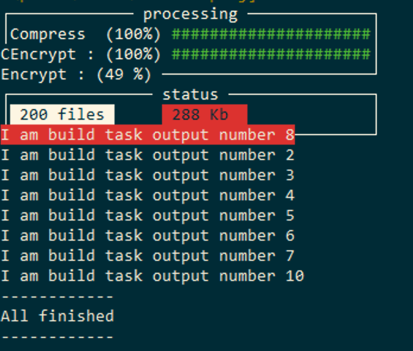
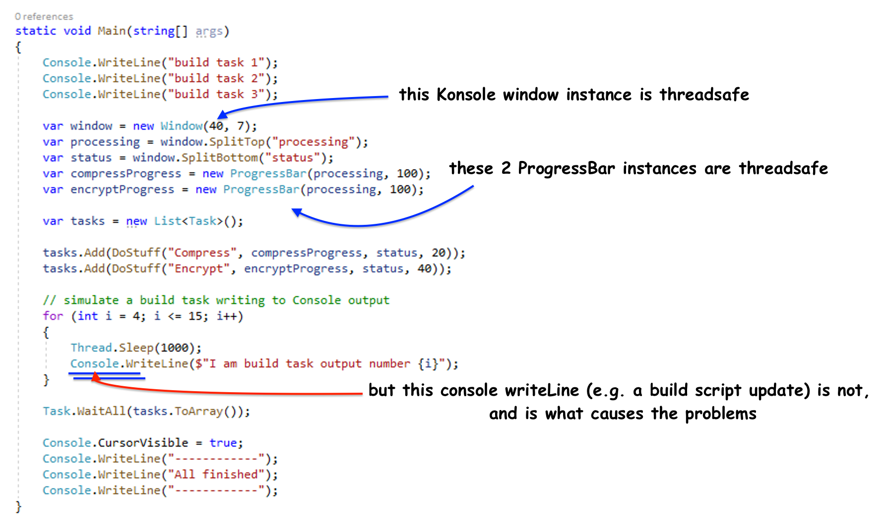
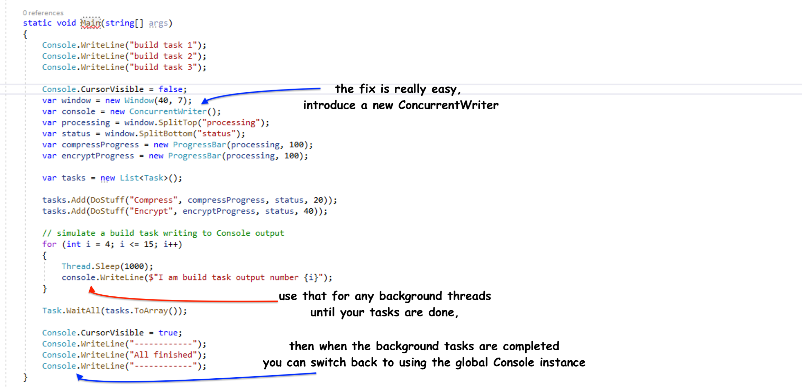
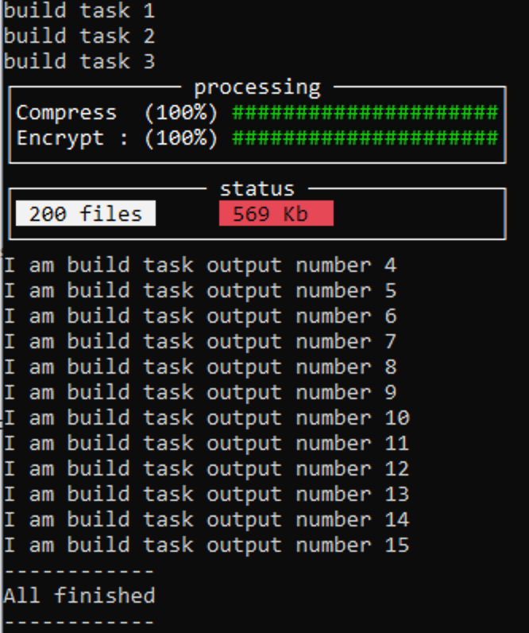

# Threading - worked examples

If you are writing a small command line utility that will be called from a build script, where you script does something, and uses threads to update the console the Konsole will make that a lot simpler.

## `ConcurrentWriter`

Use `new ConcurrentWriter()` to create a simple threadsafe writer that will write to the current console window. For example, if you tried to write your own wrapper you may likely end up with code that mostly runs well, but occasionally a race condition between your wrapper and the `System.Console` will cause either the cursor position or colors to change, or even have text appearing with small corruptions. Here's an example that does not use `ConcurrentWriter`.

**writing your own wrapper is hard!**

This is typically the types of bugs you will get when trying to write your own. It's not hugely difficult, it's just time consuming and requires a lot of concurrency testing.

In the example below, we're simuluating a main build task as a thread, and two background tasks that update a small window on the console screen. What's happened here is when we were printing the file size in Red, we have to first set `Console.ForeGround = ConsoleColor.Red`, and before we could reset the console, the main build thread just happened to switch a and wrote 'I am build task out number 8` and both the color, and the cursor position had been changed by a different thread. (sample code included at the bottom.)  



<br/>



# Fix with `ConcurrentWriter`

In the example below, we've switched from writing directly to `Console.WriteLine` and instead we make all the printing calls through a `new ConcurrentWriter()` that makes sure that any other threads do not change any console state. And we see that the color, cursorPosition and text no longer shows any corruption. Each seperate area of the screen can be written to independantly by different threads, without any complex async or threading (getAwaiter) etc shananigans.



and ... boom, working like a cracker....



# full source code for this example

```csharp

using Konsole.Internal;
using System;
using System.Collections.Generic;
using System.Threading;
using System.Threading.Tasks;
using static System.ConsoleColor;

namespace Konsole.Sample
{
    class Program
    {  
        static void Main(string[] args)
        {
            Console.WriteLine("build task 1");
            Console.WriteLine("build task 2");
            Console.WriteLine("build task 3");

            Console.CursorVisible = false;
            var window = new Window(40, 7);
            var console = new ConcurrentWriter();
            var processing = window.SplitTop("processing");
            var status = window.SplitBottom("status");
            var compressProgress = new ProgressBar(processing, 100);
            var encryptProgress = new ProgressBar(processing, 100);

            var tasks = new List<Task>();

            tasks.Add(DoStuff("Compress", compressProgress, status, 20));
            tasks.Add(DoStuff("Encrypt", encryptProgress, status, 40));

            // simulate a build task writing to Console output
            for (int i = 4; i <= 15; i++)
            {
                Thread.Sleep(1000);
                console.WriteLine($"I am build task output number {i}");
            }

            Task.WaitAll(tasks.ToArray());

            Console.CursorVisible = true;
            Console.WriteLine("------------");
            Console.WriteLine("All finished");
            Console.WriteLine("------------");
        }

        private static int _files = 0;
        private static int _bytes = 0;
        static void UpdateStatus(IConsole status, int bytes)
        {
            var files = Interlocked.Increment(ref _files);
            var kb = (Interlocked.Add(ref _bytes, bytes) / 1000);
            status.PrintAtColor(Black, 16, 0, $" {bytes} Kb  ", Red);
            status.PrintAtColor(Black, 0, 0, $" {files++} files ", White);
        }

        static Task DoStuff(string prefix, ProgressBar progress, IConsole status, int speed)
        {
            var testFiles = TestData.MakeObjectNames(100);
            var checkStuff = Task.Run(() => {
                int files = 1;
                for (int i = 1; i <= 100; i++)
                {
                    Thread.Sleep(speed + new Random().Next(100));
                    progress.Refresh(i, $"{prefix} : {testFiles[i % 100]}");
                    UpdateStatus(status, new Random().Next(1000));
                }
            });
            return checkStuff;
        }
    }
}


```
